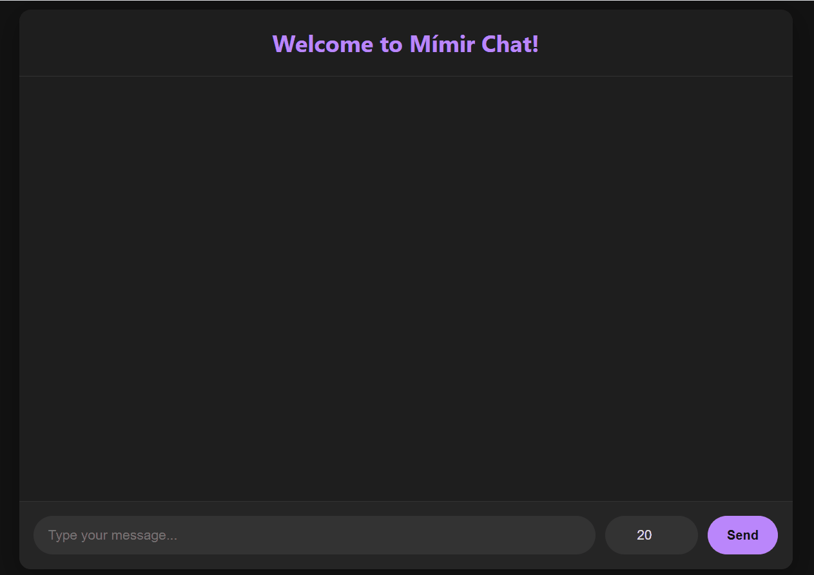
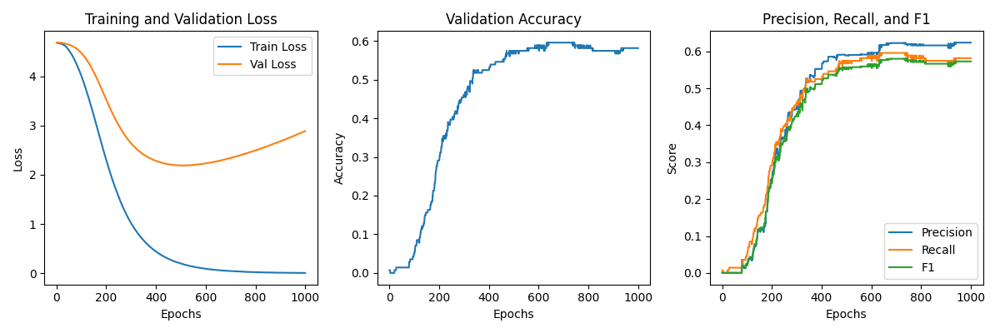

# Norway FAQ Chatbot ("Mímir")

This repository contains "Mímir," a fully functional, AI-powered chatbot designed to answer frequently asked questions about Norway. Named after the wise figure from Norse mythology, this chatbot provides instant information and can respond with generated audio.

The project was built from scratch using PyTorch and NLTK, demonstrating a complete pipeline from text processing and model training to a functional web interface with text-to-speech capabilities.

**➡️ For a full list of all questions and responses, please see the [data/intents.json](./data/intents.json) file.**

---

### Chatbot in Action


---

## ✨ Key Features & Topics

Mímir is trained to handle conversations on a diverse set of topics related to Norway, including:

* **Text-to-Speech:** Responds with both text and high-quality audio generated via the ElevenLabs API.
* **Geography:** Capital city, fjords, mountains, and famous locations like Svalbard.
* **Culture & Traditions:** National Day (May 17th), traditional food like *brunost*, and the concept of *koselig*.
* **Travel & Practical Info:** Best time to visit, currency (NOK), tipping etiquette, and public transport.
* **History & Mythology:** The Viking Age, Norwegian independence, and Norse gods like Odin and Thor.
* **General Conversation:** The chatbot can also handle greetings, goodbyes, thanks, and identify itself.

### Training Performance
The model was trained for 1000 epochs, with performance metrics like loss and accuracy tracked on a validation set. The plot below visualizes the training process.



---

## 🤖 How it Works & Tech Stack

The chatbot's intelligence is powered by a custom-built neural network and a classic Natural Language Processing (NLP) pipeline.

### 1. Text Processing (NLTK)
User input patterns are processed using NLTK for tokenization and lemmatization. The processed text is then converted into a numerical "bag-of-words" vector, which is the input for the neural network.

### 2. Model Architecture (PyTorch)
The core of the chatbot is a feed-forward neural network built with PyTorch. It consists of an input layer, two hidden layers, and an output layer that classifies the user's intent.

### 3. Tech Stack
* **Machine Learning:** `PyTorch`
* **NLP:** `NLTK`
* **Web Framework:** `Flask`
* **Text-to-Speech:** `ElevenLabs`
* **Data Handling:** `NumPy`

---

## 🚀 How to Run

There are two ways to set up the project. The Conda method is recommended for perfect reproducibility.

### Method 1: Using Conda (Recommended)

1.  **Clone the repository:**
    ```bash
    git clone [https://github.com/your-username/Norway-FAQ-Chatbot.git](https://github.com/your-username/Norway-FAQ-Chatbot.git)
    cd Norway-FAQ-Chatbot
    ```
2.  **Create the Conda environment:** This command uses the `environment.yml` file to create a perfect copy of the development environment.
    ```bash
    conda env create -f environment.yml
    ```
3.  **Activate the environment:**
    ```bash
    conda activate norway-bot
    ```
4.  **Add your API Key:** Create a `.env` file in the main project folder and add your ElevenLabs API key: `ELEVENLABS_API_KEY="your_key_here"`

5.  **Run the Flask application:**
    ```bash
    python app.py
    ```

### Method 2: Using Pip

1.  Follow steps 1 and 4 from the Conda method.
2.  **Create a virtual environment and install dependencies:**
    ```bash
    python -m venv .venv
    source .venv/bin/activate  # On Windows, use `.venv\Scripts\activate`
    pip install -r requirements.txt
    ```
3.  **Run the Flask application:**
    ```bash
    python app.py
    ```

After running, navigate to `http://127.0.0.1:5000` in your web browser.

---

## 👥 Contributors

This project was developed as a collaborative effort by:
* Engebret
* Fredrik
* Pedro

Inspired by a beginner-friendly PyTorch project and significantly enhanced to create Mímir.